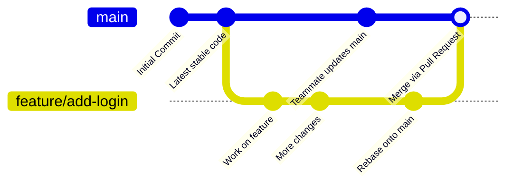

# Git & GitHub Workflow Guide for Collaborative Projects

This guide explains how to use Git and GitHub for collaborative development, with a focus on branching, **pull requests**, and **avoiding conflicts**. Even if you have used Git before, following this workflow ensures our code stays organized and consistent.

## 1. Basic Concepts

Before we start, here are some Git and GitHub concepts you need to understand:

- **Repository (repo)**: The project folder tracked by Git. GitHub hosts your repository online.
- **Commit**: A snapshot of changes in the code.
- **Branch**: A parallel version of the code. Each branch can have its own changes without affecting other branches.
- **Merge**: Combining changes from one branch into another.
- **Pull Request (PR)**: A request to merge your changes into another branch (usually main or master).
- **Origin**: The remote repository (on GitHub).
- **Local repository**: The copy of the project on your computer.

## 2. Git Branching Workflow

Branching allows multiple people to work on the project simultaneously without overwriting each other’s changes.

- **Step 1: Always start by pulling the latest changes**

```bash
git checkout main    # switch to main branch
git pull origin main # get latest updates from GitHub
```

**Why?** This ensures you have the most recent code before starting your work.

- **Step 2: Create a new branch for your feature of fix**

```bash
git checkout -b feature/my-new-feature
```

- `feature/my-new-feature` is the name of your new branch.
- You can replace `my-new-feature` with a descriptive name.
- **Step 3: Work on your changes**

```bash
git add .            # stage all changes
git commit -m "Add new feature: description"
```

**Tips:**

- Commit often with clear messages.
- Keep commits focused on a single idea or feature.
- **Step 4: Sync with remote branch**
  Before pushing, make sure your branch is up-to-date:

```bash
git fetch origin             # get latest updates from GitHub
git rebase origin/main       # apply your changes on top of latest main
```

**Why?** This prevents conflicts when you push your changes.

- **Step 5: Push your branch to GitHub**

```bash
git push origin feature/my-new-feature
```

- This uploads your branch to GitHub so others can see your work.

## 3. Pull Requests

After pushing your branch:

1. Go to the repository on GitHub.
2. You’ll see a suggestion to create a Pull Request.
3. Click Create Pull Request.
4. Add a descriptive title and explanation of your changes.
5. Assign reviewers if needed.
6. Merge the PR only after review and confirmation.

**Important**: Do not delete your branch until the PR is merged. Branches can be deleted afterward to keep the repo clean.

## 4. Updating Your Local Branch

While you are working, someone else might push changes to main. To keep your branch updated:

```bash
git fetch origin
git checkout main
git pull origin main
git checkout feature/my-new-feature
git rebase main
```

**Tip**: Always pull and rebase before pushing. This prevents “update anomalies” or conflicts.

## 5. Resolving Conflicts

If Git can’t merge changes automatically, it will show a merge conflict.
Steps to resolve:

1. Open the conflicted files and decide which changes to keep.
2. After fixing, stage and commit the resolved files:

```bash
git add conflicted_file
git commit -m "Resolve merge conflict in conflicted_file"
```

3. Continue your rebase if needed:

```bash
git rebase --continue
```

## 6. Summary of Best Practices

- **Never work directly** on `main`; always use a feature branch.
- **Always pull the latest changes** from `main` before starting work.
- **Commit often with clear messages**.
- **Push your feature branch** to GitHub frequently.
- **Create a PR** and get approval before merging.
- **Keep branches up-to-date** to avoid conflicts.
- **Delete merged branches** to keep the repository clean.

## 7. Example Workflow

```bash
git checkout main
git pull origin main
git checkout -b feature/add-login
# work on code...
git add .
git commit -m "Add login page"
git fetch origin
git rebase origin/main
git push origin feature/add-login
# create PR on GitHub
```

## 8. Example Graph



## 9. Branch Naming Conventions

Branch names are just text labels, but organizing them with consistent prefixes makes the repository easier to read and understand. These prefixes don’t change how Git behaves—they’re simply a convention used by many development teams to categorize work.

Here are common branch prefixes you can use:

- `feature/...` → for new features
  Example: feature/add-login-page

- `fix/...` or `bugfix/...` → for correcting bugs
  Example: fix/button-not-clickable

- `refactor/...` → for improving code structure without changing behavior
  Example: refactor/simplify-auth-module

`docs/...` → for documentation changes only
Example: docs/git-workflow-guide

Using these prefixes helps you instantly understand what a branch is about.
It also keeps the repository clean and consistent, especially when multiple people are working on different areas of the project.
