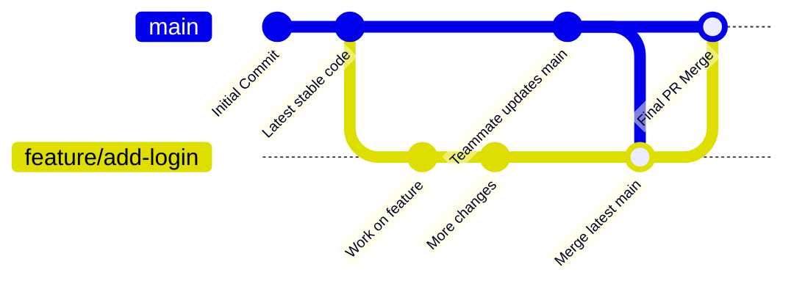

# 🚀 Git & GitHub Workflow Guide for Collaborative Projects (Beginner-Friendly)

This guide explains how to use **Git** and **GitHub** for collaborative development, with a focus on branching, **Pull Requests (PRs)**, and **avoiding conflicts**. Following this workflow ensures our code stays organized and consistent.

---

## 1. Basic Concepts

Before we start, here are some Git and GitHub concepts you need to understand:

- **Repository (repo)**: The project folder tracked by Git. GitHub hosts your repository online.
- **Commit**: A snapshot of changes in the code. Think of it as saving your game progress.
- **Branch**: A parallel version of the code. Each branch can have its own changes without affecting others.
- **`main` branch**: The primary, stable branch of the project. This is where all final, working code lives.
- **Merge**: Combining changes from one branch into another, creating a single merge commit to track the history.
- **Pull Request (PR)**: A request to merge your changes into another branch (usually `main`). This is the standard process for code review and approval.
- **Origin**: The remote repository (on GitHub).
- **Local repository**: The copy of the project on your computer.

---

## 2. Git Branching Workflow

Branching allows multiple people to work on the project simultaneously without overwriting each other’s changes.



### Step 1: Always start by pulling the latest changes

```bash
git checkout main    # 1. Switch to the main branch
git pull origin main # 2. Get latest updates from GitHub
```

**Why?** This ensures you have the **most recent code** before starting your work.

### Step 2: Create a new branch for your feature or fix

```bash
git checkout -b feature/my-new-feature
```

`feature/my-new-feature` is the name of your new branch.

Replace it with a descriptive name (e.g., `fix/button-bug`).

### Step 3: Work on your changes

```bash
git add .            # Stage all changes in the current directory
git commit -m "Add new feature: description"
```

Tips:

- **Commit often** with clear, concise messages.
- Keep commits focused on a single idea or task.

### Step 4: Keep your feature branch up-to-date (using Merge)

Before pushing your changes, it's a good practice to incorporate the latest changes from main into your feature branch. This helps minimize conflicts later.

```bash
git merge origin/main
```

**Why?** This incorporates the latest team changes, minimizing conflicts when you create your Pull Request (PR).

### Step 5: Push your branch to GitHub

```bash
git push origin feature/my-new-feature
```

This uploads your branch to GitHub so others can see your work

## 3. Pull Requests

After pushing your branch:

1. Go to the repository on GitHub.
2. You’ll see a suggestion to create a Pull Request from your newly pushed branch.
3. Click Create Pull Request.
4. Add a descriptive title and explanation of your changes.
5. Assign reviewers if needed.
6. The PR is only merged into main after review and confirmation.

**Important**: Do not delete your branch until the PR is merged. Branches can be deleted afterward to keep the repo clean.

## 4. Updating Your Local Branch

While you are working, someone else might push changes to main. To safely bring those new changes into your feature branch, you'll merge them.

```bash
git checkout main           # Go to the main branch
git pull origin main        # Get the latest updates from GitHub
git checkout feature/my-new-feature # Go back to your feature branch
git merge main              # Merge the latest main into your branch
```

**Tip**: Do this before you push your final changes and create a PR. Merging often makes your final PR merge smoother.

## 5. Resolving Conflicts

If Git can’t automatically combine the changes during a git merge, it stops and shows you a merge conflict.

Steps to resolve:

1. Open the conflicted file(s) and look for the conflict markers (`<<<<<<<`, `=======`, `>>>>>>>`).
2. **Manually edit** the file to decide which code to keep (yours, the team's, or a combination). **Delete the conflict markers.**
3. After fixing, stage and commit the resolved file(s). This completes the merge.

```bash
git add conflicted_file
git commit -m "Resolve merge conflict during main update"
```

## 6. Summary of Best Practices

- Never work directly on `main`; always use a feature branch.
- Always pull the latest changes from `main` before starting work.
- Commit often with clear messages.
- Use `git merge main` to update your feature branch.
- Push your feature branch to GitHub frequently.
- Create a PR and get approval before merging.
- Delete merged branches to keep the repository clean.

## 7. Example Workflow

```bash
git checkout main
git pull origin main
git checkout -b feature/add-login
# work on code...
git add .
git commit -m "Add login page"
# Before pushing, update your branch with the latest 'main'
git merge origin/main   # Merge latest team changes
git push origin feature/add-login
# create PR on GitHub
```

## 8. Branch Naming Conventions

Using consistent prefixes makes the repository easier to read and understand:

- `feature/...` → for new features
  - Example: `feature/add-login-page`
- `fix/...` or `bugfix/...` → for correcting bugs
  - Example: `fix/button-not-clickable`
- `refactor/...` → for improving code structure without changing behavior
  - Example: `refactor/simplify-auth-module`
- `docs/...` → for documentation changes only
  - Example: `docs/git-workflow-guide`
